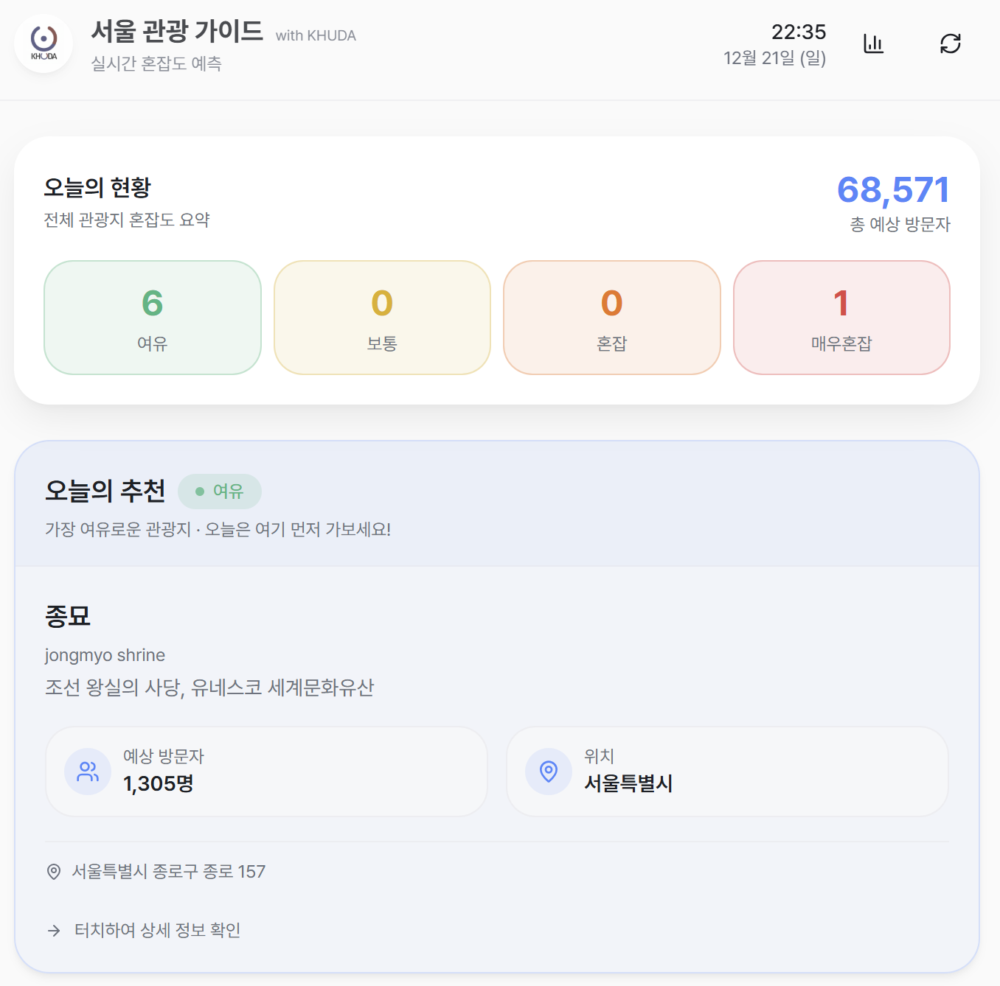
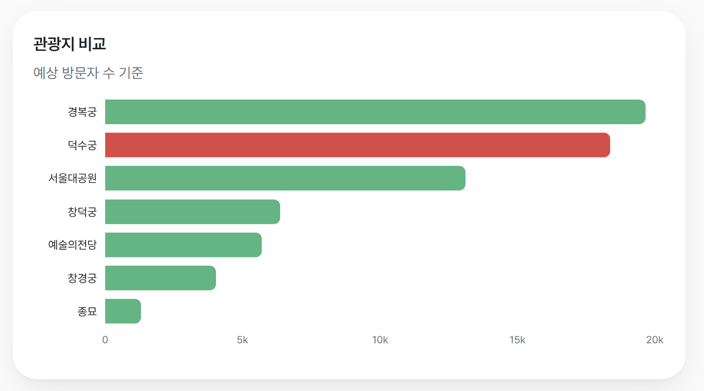
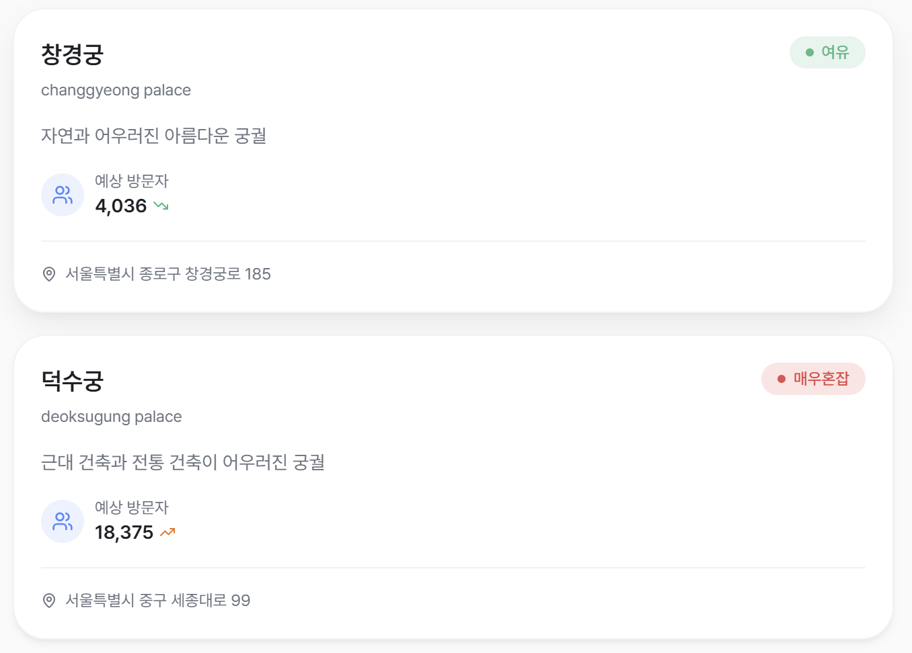
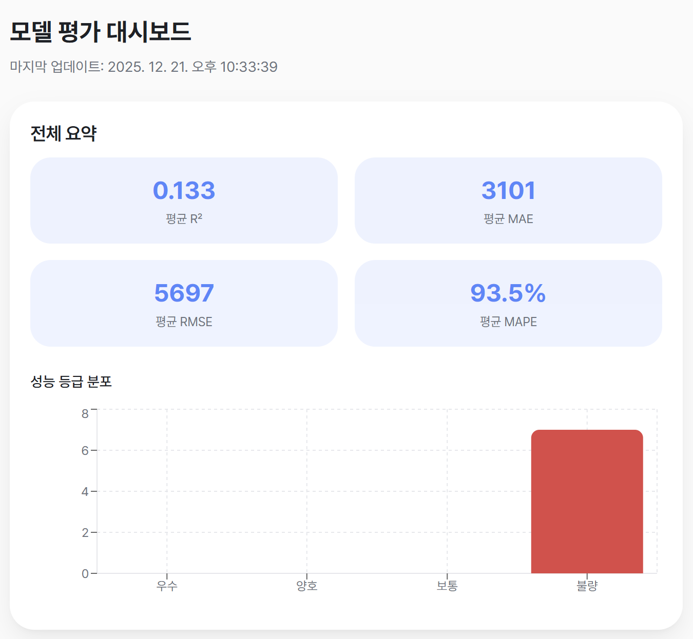
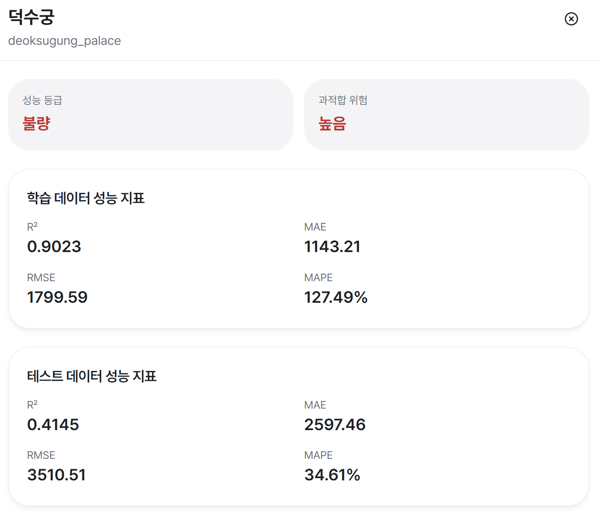
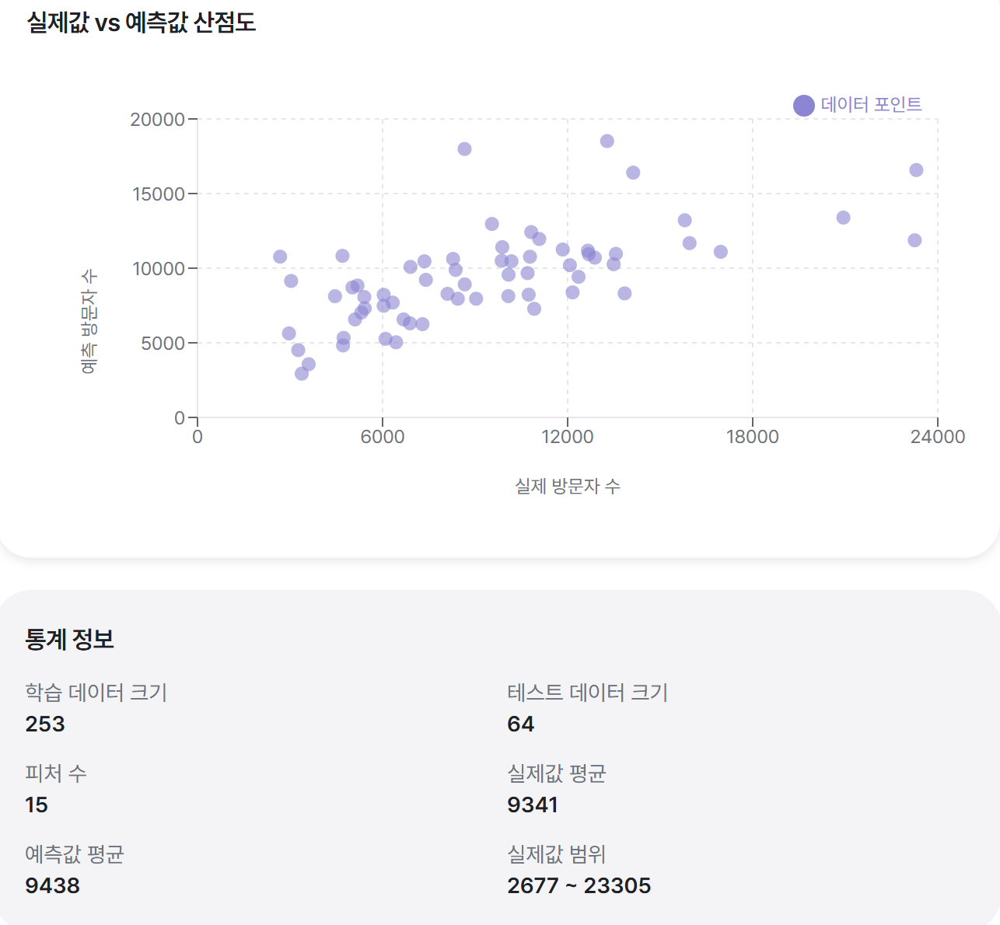

# 서울 관광 가이드 with KHUDA

서울 내 주요 관광지의 실시간 혼잡도를 예측하고 모델 성능을 평가하는 머신러닝 기반 웹 서비스입니다.

## 주요 기능

- **실시간 혼잡도 예측**: 서울 주요 관광지 7곳의 예상 방문자 수 및 혼잡도 예측
- **오늘의 추천**: 가장 여유로운 관광지 추천
- **모델 성능 대시보드**: 전체 모델 성능 요약 및 관광지별 상세 평가
- **관광지별 현황**: 각 관광지의 상세 정보 및 예측 데이터 시각화

## 스크린샷

### 홈 화면


*오늘의 현황과 오늘의 추천*





### 모델 성능 대시보드


*전체 모델 성능 요약 및 관광지별 평가*





## 기술 스택

### 백엔드
- **FastAPI**: RESTful API 서버
- **XGBoost**: 머신러닝 모델 (모델 교체 가능)
- **SQLite**: 데이터베이스

### 프론트엔드
- **React**: UI 프레임워크
- **TypeScript**: 타입 안정성
- **Vite**: 빌드 도구
- **Recharts**: 데이터 시각화
- **Shadcn UI**: UI 컴포넌트

### ML/AI
- **XGBoost**: 기본 회귀 모델
- **Scikit-learn**: 데이터 전처리 및 평가
- **Pandas**: 데이터 처리

## 시작하기

### 사전 요구사항

- Python 3.8 이상
- Node.js 18 이상
- API 키:
  - 서울시 대기환경 API 키 (`SEOUL_AIR_QUALITY_API_KEY`)
  - 기상청 API 키 (`KMA_API_KEY`)

### 설치 및 실행

#### 1. 백엔드 설정

```bash
# 가상환경 생성 및 활성화
python3 -m venv venv
source venv/bin/activate  # Linux/Mac
# 또는 venv\Scripts\activate  # Windows

# 패키지 설치
pip install -r ml_service/requirements.txt
pip install -r backend/requirements.txt

# 환경 변수 설정 (.env 파일 생성)
# SEOUL_AIR_QUALITY_API_KEY=your_key
# KMA_API_KEY=your_key

# 모델 학습 (최초 1회)
python scripts/train_models.py

# 백엔드 실행
python backend/main.py
```

백엔드는 `http://localhost:8000`에서 실행됩니다.

#### 2. 프론트엔드 설정

```bash
cd frontend

# 패키지 설치
npm install

# 개발 서버 실행
npm run dev
```

프론트엔드는 `http://localhost:5173`에서 실행됩니다.

## API 문서

백엔드 실행 후 다음 URL에서 API 문서를 확인할 수 있습니다:

- **Swagger UI**: http://localhost:8000/docs
- **ReDoc**: http://localhost:8000/redoc

### 주요 엔드포인트

- `GET /api/tourist-sites` - 모든 관광지 정보 조회
- `GET /api/predict/{tourist_code}` - 단일 관광지 혼잡도 예측
- `GET /api/predict-all` - 모든 관광지 혼잡도 예측
- `GET /api/evaluate/{tourist_code}` - 단일 관광지 모델 성능 평가
- `GET /api/evaluate-all` - 모든 관광지 모델 성능 평가
- `GET /api/health` - 서비스 헬스 체크

## 모델 교체

이 프로젝트는 모델 교체가 용이하도록 설계되었습니다. 다음 모델 타입을 지원합니다:

- **xgboost** (기본값): XGBoost 회귀 모델
- **random_forest**: Random Forest 회귀 모델
- **lightgbm**: LightGBM 회귀 모델 (선택적)
- **catboost**: CatBoost 회귀 모델 (선택적)

### 모델 교체 방법

```bash
# 환경변수로 모델 타입 지정
MODEL_TYPE=random_forest python scripts/train_models.py
```

자세한 내용은 [모델 교체 가이드](./docs/MODEL_SWAPPING.md)를 참조하세요.

## 프로젝트 구조

```
7th-ML-Team6/
├── backend/          # FastAPI 백엔드
├── frontend/         # React 프론트엔드
├── ml_service/       # ML 서비스 패키지
├── scripts/          # 학습/평가 스크립트
├── models/           # 학습된 모델 파일
├── data/             # 데이터베이스
└── docs/             # 문서
```

## 문서

상세한 문서는 [docs/](./docs/) 폴더를 참조하세요:

- [아키텍처](./docs/ARCHITECTURE.md) - 프로젝트 구조 및 데이터 흐름
- [API 문서](./docs/API.md) - API 엔드포인트 상세 설명
- [모델 교체 가이드](./docs/MODEL_SWAPPING.md) - 모델 교체 방법
- [모델 평가](./docs/MODEL_EVALUATION.md) - 모델 평가 지표 및 기준
- [데이터 관리](./docs/DATA_MANAGEMENT.md) - 데이터베이스 관리
- [가상환경 설정](./docs/VENV_SETUP.md) - 가상환경 설정

## 라이선스

이 프로젝트는 교육 목적으로 개발되었습니다.
